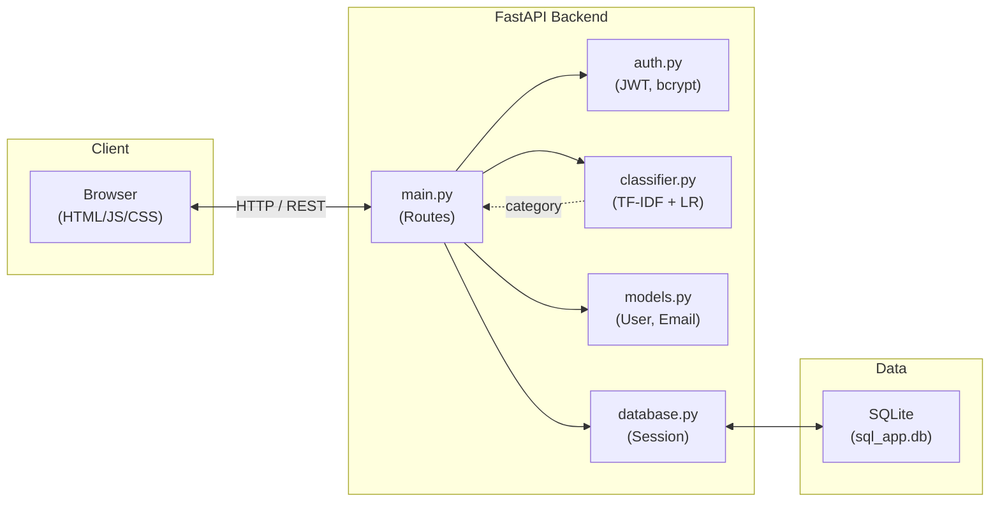
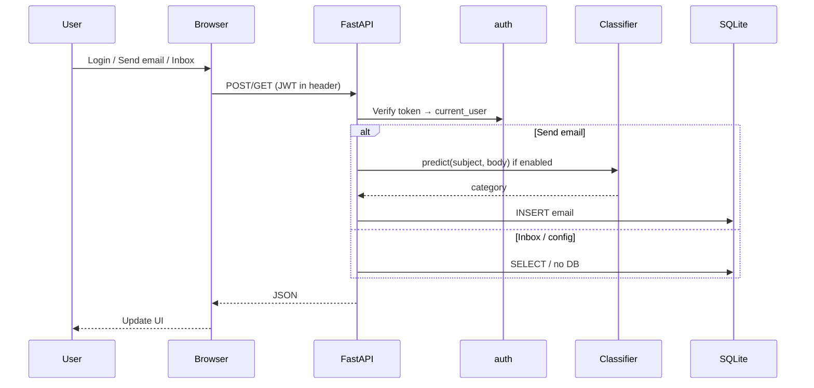

# AI Email Classifier for Students

An AI-powered email system for students that automatically classifies sent and received emails into **Assignments**, **Notices**, **Personal**, and **Spam** using a machine learning model (TF-IDF + Logistic Regression).

---

## Features

- **Smart classification** — Incoming/sent emails are auto-categorized using a trained classifier.
- **Toggle AI classification** — Turn classification on or off from the app header (no server restart). When off, new emails use the default category **Personal**.
- **Category folders** — Inbox views: All Mail, Assignments, Notices, Personal, Spam.
- **Manual override** — Recipients can change an email’s category from the inbox.
- **Auth** — Register and sign in with email and password (JWT, bcrypt).
- **Responsive UI** — Dark theme, scrollable layout when content overflows.

---

## Tech Stack

| Layer    | Stack                          |
| -------- | ------------------------------ |
| Backend  | FastAPI, Python 3.x             |
| Frontend | Vanilla JS, HTML, CSS (static)  |
| Database | SQLite (`sql_app.db`)          |
| ML       | scikit-learn, pandas           |
| Auth     | JWT (python-jose), passlib     |

---

## Architecture

High-level layout: browser (static UI) talks to FastAPI; FastAPI uses auth, classifier, and SQLite.



**Request flow (simplified):**



---

## Project Structure

```
├── backend/
│   ├── main.py         # FastAPI app, routes, config
│   ├── models.py       # SQLAlchemy User & Email
│   ├── database.py     # SQLite engine, session
│   ├── auth.py         # Password hash, JWT, get_current_user
│   ├── classifier.py   # EmailClassifier (TF-IDF + LogisticRegression)
│   └── requirements.txt
├── static/
│   ├── index.html
│   ├── app.js
│   └── style.css
├── sql_app.db          # SQLite database (created on first run)
├── run.bat             # One-click run (venv + server + open browser)
└── README.md
```

---

## How to Run

### Option 1: Double-click `run.bat` (Windows)

1. Double-click **run.bat** in the project root.
2. It will create a venv (if needed), install dependencies, start the server, and open **http://127.0.0.1:8000** in your browser.

### Option 2: VS Code (Run and Debug)

1. Open the project folder in VS Code.
2. Open **Run and Debug** (Play/Bug icon), select **"Run Email Classifier"**, then press the green Play button.
3. Open **http://127.0.0.1:8000** in your browser.

### Option 3: Manual (terminal)

From the project root:

```bash
python -m venv venv
venv\Scripts\activate
pip install -r backend\requirements.txt
python -m backend.main
```

Then open **http://127.0.0.1:8000**.

---

## Configuration

- **AI classification on/off**  
  - **In app:** Use the **AI classification** toggle in the dashboard header.  
  - **At startup:** Set env var `ENABLE_EMAIL_CLASSIFICATION` to `true` or `false` (default: `true`).  
  - Example in `run.bat`: `set ENABLE_EMAIL_CLASSIFICATION=true`

---

## Database (SQLite)

The app uses one SQLite database: **`sql_app.db`** in the project root (created on first run).  
**Requirement:** [SQLite](https://www.sqlite.org/download.html) on your PATH.  
**All steps:** run from the **project root** (folder that contains `sql_app.db`).

---

### Option 1 — sqlite3 (if installed)

**Full dump:**

```bash
sqlite3 sql_app.db ".dump"
```

**Or print each table:**

```bash
sqlite3 sql_app.db "SELECT * FROM users;" "SELECT * FROM emails;"
```

**Interactive:** open the database, then run the commands below at the `sqlite>` prompt.

```bash
sqlite3 sql_app.db
```

Then at the `sqlite>` prompt:

```sql
.tables
SELECT * FROM users;
SELECT * FROM emails;
.quit
```

---

### Step 1 — Show / open the database

- **Show where the database is:** the file is `sql_app.db` in the project root.
- **Open the database** (interactive mode):

```bash
sqlite3 sql_app.db
```

You get a `sqlite>` prompt. Type `.quit` to exit.

- **One-shot** (run one command and exit):

```bash
sqlite3 sql_app.db "<command or SQL>"
```

---

### Step 2 — Show tables

List all tables:

```bash
sqlite3 sql_app.db ".tables"
```

You should see **users** and **emails**.

Show table definitions (schema):

```bash
sqlite3 sql_app.db ".schema"
```

Show schema for one table only:

```bash
sqlite3 sql_app.db ".schema users"
```

---

### Step 3 — Show data in a table (retrieve data)

**All rows in `users`:**

```bash
sqlite3 sql_app.db "SELECT * FROM users;"
```

**All rows in `emails`:**

```bash
sqlite3 sql_app.db "SELECT * FROM emails;"
```

**With column headers and aligned columns:**

```bash
sqlite3 sql_app.db ".mode column" ".headers on" "SELECT * FROM users;"
sqlite3 sql_app.db ".mode column" ".headers on" "SELECT * FROM emails;"
```

**Specific columns:**

```bash
sqlite3 sql_app.db "SELECT id, email FROM users;"
sqlite3 sql_app.db "SELECT id, subject, category, timestamp FROM emails;"
```

**With a condition (e.g. emails for recipient 1):**

```bash
sqlite3 sql_app.db "SELECT * FROM emails WHERE recipient_id=1;"
```

---

### Step 4 — Quick reference

| Goal | Command |
| -----| --------|
| Open database | `sqlite3 sql_app.db` |
| Show tables | `sqlite3 sql_app.db ".tables"` |
| Show schema | `sqlite3 sql_app.db ".schema"` |
| Show data in `users` | `sqlite3 sql_app.db "SELECT * FROM users;"` |
| Show data in `emails` | `sqlite3 sql_app.db "SELECT * FROM emails;"` |
| Pretty-print table | `sqlite3 sql_app.db ".mode column" ".headers on" "SELECT * FROM users;"` |

---

### Tables and columns (this project)

| Table | Columns |
| ----- | ------- |
| **users** | `id`, `email`, `hashed_password` |
| **emails** | `id`, `sender_id`, `recipient_id`, `subject`, `body`, `category`, `timestamp` |

**category** values: `Assignments`, `Notices`, `Personal`, `Spam`.

### CRUD (Create, Update, Delete)

| Operation | Example |
| --------- | ------- |
| **Create** user | Prefer app **Register**. Or: `sqlite3 sql_app.db "INSERT INTO users (email, hashed_password) VALUES ('x@y.com', '<bcrypt_hash>');"` |
| **Create** email | `sqlite3 sql_app.db "INSERT INTO emails (sender_id, recipient_id, subject, body, category, timestamp) VALUES (1, 2, 'Subj', 'Body', 'Personal', datetime('now'));"` |
| **Update** | `sqlite3 sql_app.db "UPDATE emails SET category='Spam' WHERE id=1;"` |
| **Delete** | `sqlite3 sql_app.db "DELETE FROM emails WHERE id=1;"` |


Use app **Register** for new users (password is hashed). New emails are usually created via the app.

---

## API Overview

| Method | Endpoint                     | Description                    |
| ------ | ---------------------------- | ------------------------------ |
| POST   | `/auth/register`             | Register new user              |
| POST   | `/auth/login`                | Login, returns JWT             |
| GET    | `/config/classification`     | Get AI classification on/off   |
| PATCH  | `/config/classification`     | Set AI classification on/off   |
| POST   | `/emails/send`               | Send email (auto or default)   |
| GET    | `/emails/inbox`              | Get inbox (JWT required)       |
| PATCH  | `/emails/{id}/category`      | Update email category          |

Static app is served at `/` and under `/static/`.
